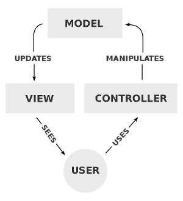

# Base MVC project for development under Platformio
[](https://www.arduino.cc/)
[](https://platformio.org/)
[](https://www.codacy.com?utm_source=github.com&amp;utm_medium=referral&amp;utm_content=Melkoroth/Base-MVC-for-Platformio&amp;utm_campaign=Badge_Grade)
[](https://travis-ci.com/Melkoroth/Base-MVC-for-Platformio)

This is a barebones project used as base to develop projects under the Platformio ecosystem. Some features include:
* Implements the **Model-View-Controller** pattern.
* Built using **Platformio** folder structure. There are some different example configurations under [platformio.ini](platformio.ini)
* Uses **git submodules** for external libraries. To add them do ```git submodule init```[.gitmodules](.gitmodules)
* Is **Travis CI** enabled [.travis.yml](.travis.yml). There's also another Travis script that manually downloads external libraries instead of relying on git submodules [.travisExplicitLibraries.yml](.travisExplicitLibraries.yml)

## Model View Controller Implementation
You can read about the pattern on [Wikipedia](https://en.wikipedia.org/wiki/Model%E2%80%93view%E2%80%93controller). Basically, you decouple the logic part from the user interaction which has multiple benefits.



- **Model** manages the data, logic and rules of the system. Extends *ObservablePattern* class.
- **View** displays the model data. You can have various different Views on a system as long as every one of them extend *ObserverPattern* class.
- **Controller** Accepts the input and converts it to commands for the Model.
- **Events** Events the messages the Model passes to the View(s).

#### Setting up:
```c++
//Object creations in main .ino
Model model;
//The controller knows about the Model
Controller controller(&model);
//The view knows about the Controller
SerialUI serialUI(&controller);
//Attach view in main .ino
model.attachObserver(&serialUI);
//You could also detach with
model.detachObserver(&serialUI);
```

#### Flow of interactions:
```c++
//Change the Model from the controller
_model->someMethod(someVars);
//The Model does some stuff and creates an Event to warn the Views it has changed
EventWhatever event(someMoreVars);
notifyObservers(&event);
//The Views receive the Event and processes it whithin
void update(Event *const);
```

